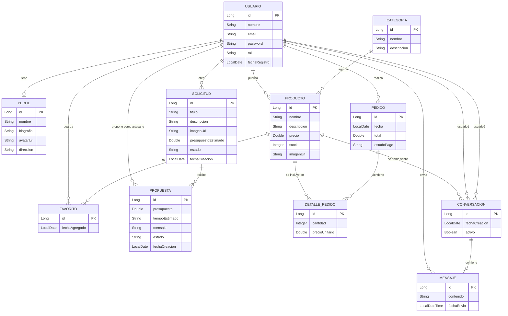
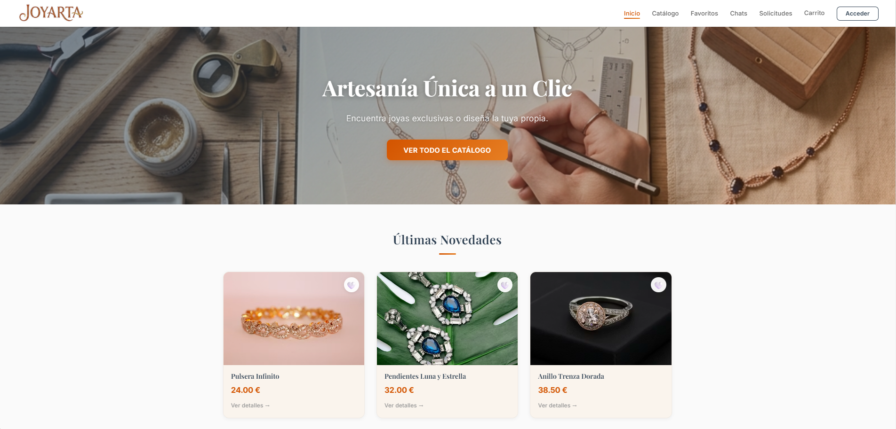
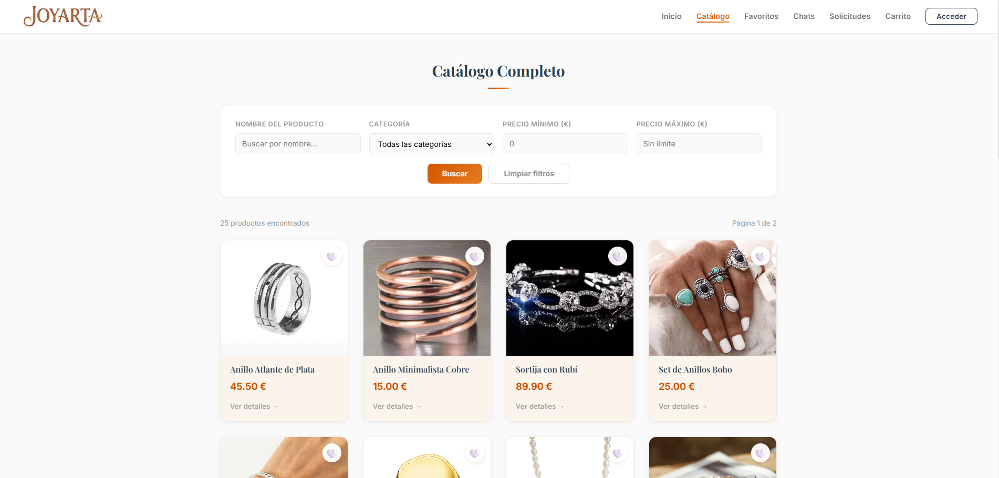
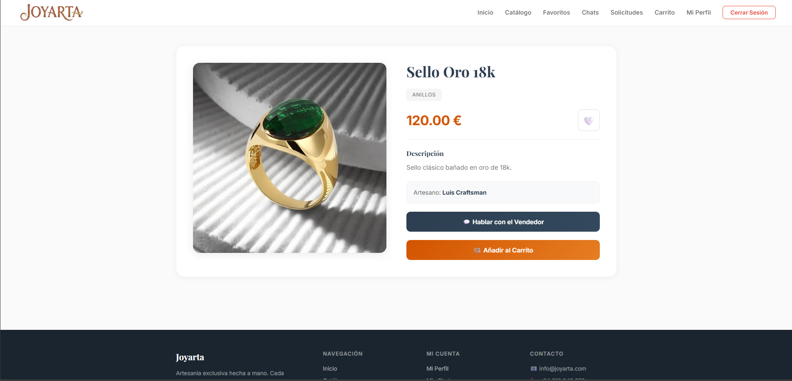
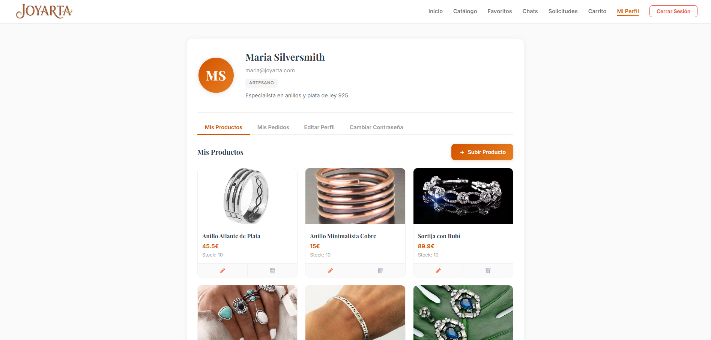
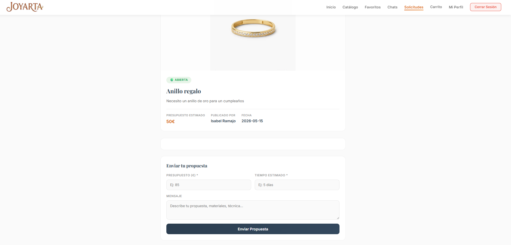

<p align="center">
  <h1 align="center">💎 Joyarta</h1>
  <p align="center">
    Marketplace artesanal donde artesanos y clientes se conectan para crear, descubrir y adquirir joyas únicas.
  </p>
</p>

<p align="center">
  
  
  
  
  
</p>

---

## 📖 Sobre el Proyecto

**Joyarta** es una aplicación web fullstack desarrollada como proyecto de fin de ciclo de DAW. Funciona como un marketplace especializado en joyería artesanal, donde:

- Los **artesanos** pueden publicar sus creaciones, gestionar el stock y responder a encargos personalizados.
- Los **clientes** pueden explorar el catálogo, comprar productos, guardar favoritos, contactar directamente con los artesanos y solicitar piezas a medida.

---

## ✨ Funcionalidades

### 👤 Usuarios y Autenticación
- Registro de nuevas cuentas con validación de email único
- Inicio de sesión con credenciales (email + contraseña)
- Edición de perfil personal
- Cambio de contraseña con verificación de la contraseña actual

### 🛍️ Tienda y Catálogo
- Exploración del catálogo completo de productos
- **Filtros avanzados**: búsqueda por nombre, categoría y rango de precios
- Vista de productos recientes
- Detalle individual de cada producto con información completa
- Gestión de categorías

### 📦 Gestión de Productos (Artesanos)
- Crear, editar y eliminar productos
- Control de stock con alertas de stock bajo
- Listado de productos propios

### ❤️ Favoritos
- Marcar y desmarcar productos como favoritos
- Galería personal de productos guardados
- Verificación rápida de si un producto ya está en favoritos

### 🛒 Carrito y Pedidos
- Carrito de compras con gestión de cantidades
- Proceso de compra completo con validación de stock
- Descuento automático del stock tras la compra
- Seguimiento de pedidos con estados (`PENDIENTE`, etc.)
- Historial de pedidos del usuario con detalles (producto, cantidad, precio unitario)

### 💬 Chat / Mensajería
- Sistema de conversaciones en tiempo real entre usuarios
- Conversaciones vinculadas a productos específicos
- Envío y recepción de mensajes con marca de tiempo
- Listado de todas las conversaciones activas

### 📝 Solicitudes y Propuestas Personalizadas
- Los clientes pueden crear solicitudes de piezas a medida (título, descripción, imagen de referencia, presupuesto estimado)
- Los artesanos pueden enviar propuestas con presupuesto, tiempo estimado y mensaje
- El cliente puede **aceptar** o **rechazar** cada propuesta
- Listado y detalle de solicitudes por usuario

---

## 🗺️ Rutas del Frontend

| Ruta | Página | Descripción |
| :--- | :--- | :--- |
| `/home` | Inicio | Página principal con productos destacados |
| `/catalogo` | Catálogo | Exploración con filtros por nombre, categoría y precio |
| `/productos/:id` | Detalle Producto | Información completa, opción de compra y favorito |
| `/login` | Iniciar Sesión | Formulario de autenticación |
| `/registro` | Registro | Creación de nueva cuenta |
| `/perfil` | Mi Perfil | Gestión de cuenta, productos y pedidos |
| `/carrito` | Carrito | Resumen de compra y checkout |
| `/favoritos` | Mis Favoritos | Productos guardados por el usuario |
| `/chat` | Mensajería | Centro de conversaciones con otros usuarios |
| `/solicitudes` | Solicitudes | Panel de encargos personalizados |
| `/solicitudes/:id` | Detalle Solicitud | Revisión de propuestas recibidas |
| `**` | 404 | Página no encontrada |

---

## 🔌 API REST — Endpoints del Backend

Todos los endpoints están bajo el prefijo `http://localhost:8080/api`.

### `/api/usuarios`

| Método | Endpoint | Descripción |
| :--- | :--- | :--- |
| `POST` | `/registro` | Registrar nuevo usuario |
| `POST` | `/login` | Iniciar sesión |
| `GET` | `/{id}` | Obtener usuario por ID |
| `GET` | `/{id}/perfil` | Obtener perfil del usuario |
| `PUT` | `/{id}/perfil` | Editar perfil |
| `PUT` | `/{id}/password` | Cambiar contraseña |
| `GET` | `/{id}/productos` | Productos publicados por el usuario |
| `GET` | `/{id}/pedidos` | Pedidos realizados por el usuario |

### `/api/tienda`

| Método | Endpoint | Descripción |
| :--- | :--- | :--- |
| `GET` | `/productos` | Listar productos (filtros: `nombre`, `categoria`, `precioMin`, `precioMax`) |
| `POST` | `/productos` | Publicar nuevo producto |
| `GET` | `/productos/{id}` | Detalle de un producto |
| `PUT` | `/productos/{id}` | Actualizar producto |
| `DELETE` | `/productos/{id}` | Eliminar producto |
| `GET` | `/productos/recientes` | Últimos productos añadidos |
| `GET` | `/productos/stock-bajo/{idArtesano}` | Productos con stock bajo (param: `minimo`) |
| `GET` | `/categorias` | Listar todas las categorías |

### `/api/pedidos`

| Método | Endpoint | Descripción |
| :--- | :--- | :--- |
| `POST` | `/` | Crear pedido desde el carrito |
| `GET` | `/{id}` | Obtener pedido por ID |
| `PUT` | `/{id}/estado` | Cambiar estado de pago del pedido |

### `/api/favoritos`

| Método | Endpoint | Descripción |
| :--- | :--- | :--- |
| `POST` | `/` | Añadir producto a favoritos |
| `DELETE` | `/` | Quitar producto de favoritos |
| `GET` | `/` | Listar todos los favoritos |
| `GET` | `/verificar/{idUsuario}/{idProducto}` | Comprobar si un producto es favorito |
| `GET` | `/usuario/{idUsuario}` | Favoritos de un usuario |

### `/api/conversaciones`

| Método | Endpoint | Descripción |
| :--- | :--- | :--- |
| `GET` | `/usuario/{idUsuario}` | Conversaciones de un usuario |
| `POST` | `/` | Crear nueva conversación |
| `GET` | `/{id}/mensajes` | Obtener mensajes de una conversación |
| `POST` | `/{id}/mensajes` | Enviar mensaje en una conversación |

### `/api/solicitudes`

| Método | Endpoint | Descripción |
| :--- | :--- | :--- |
| `GET` | `/` | Listar todas las solicitudes |
| `GET` | `/{id}` | Detalle de una solicitud |
| `POST` | `/` | Crear solicitud personalizada |
| `DELETE` | `/{id}` | Eliminar solicitud |
| `GET` | `/usuario/{id}` | Solicitudes de un usuario |
| `GET` | `/{id}/propuestas` | Propuestas recibidas en una solicitud |
| `POST` | `/{id}/propuestas` | Enviar propuesta a una solicitud |
| `PUT` | `/propuestas/{id}/aceptar` | Aceptar una propuesta |
| `PUT` | `/propuestas/{id}/rechazar` | Rechazar una propuesta |

---

## 🏗️ Arquitectura del Proyecto

```
Proyecto-Joyarta/
├── Cliente/                        # Frontend — Angular 20
│   └── src/app/
│       ├── carrito/                 # Componente del carrito de compras
│       ├── catalogo/                # Exploración de productos
│       ├── chat/                    # Sistema de mensajería
│       ├── detalle-producto/        # Vista individual de producto
│       ├── detalle-solicitud/       # Vista individual de solicitud
│       ├── home/                    # Página de inicio
│       ├── login/                   # Inicio de sesión
│       ├── mis-favoritos/           # Lista de favoritos
│       ├── perfil/                  # Panel de usuario
│       ├── registro/                # Registro de cuenta
│       ├── solicitudes/             # Panel de solicitudes
│       ├── models/                  # Interfaces y modelos TypeScript
│       └── services/                # Servicios HTTP (Angular)
│
└── Servidor/                       # Backend — Spring Boot
    └── src/main/java/.../joyarta/
        ├── controller/              # Controladores REST
        ├── model/                   # Entidades JPA
        ├── repository/              # Repositorios Spring Data
        └── service/                 # Lógica de negocio
```

---

## 🛠️ Stack Tecnológico

| Capa | Tecnología | Versión |
| :--- | :--- | :--- |
| **Frontend** | Angular | 20 |
| **Lenguaje Frontend** | TypeScript | 5.9 |
| **Backend** | Spring Boot (Web + JPA) | 3.x |
| **Lenguaje Backend** | Java | JDK |
| **Base de Datos** | MariaDB | — |
| **Gestión de paquetes** | npm / Maven | — |

---

## 🚀 Puesta en Marcha

### Requisitos Previos
- **Node.js** y **npm** instalados
- **Java JDK** instalado
- **MariaDB** en ejecución en `localhost:3306`

### 1. Configurar la Base de Datos

Ejecutar en MariaDB:

```sql
CREATE DATABASE IF NOT EXISTS jpa;
CREATE USER IF NOT EXISTS 'luis'@'localhost' IDENTIFIED BY 'luis';
GRANT ALL PRIVILEGES ON jpa.* TO 'luis'@'localhost';
FLUSH PRIVILEGES;
```

### 2. Iniciar el Backend

```bash
cd Servidor/Joyarta
./mvnw spring-boot:run
```

El servidor arrancará en `http://localhost:8080`.

### 3. Iniciar el Frontend

```bash
cd Cliente
npm install
ng serve
```

La aplicación estará disponible en `http://localhost:4200`.

---

## 🗄️ Modelo de Datos (Diagrama E-R)



---

## 📸 Capturas de Pantalla

### 🏠 Inicio


### 🛍️ Catálogo Completo


### 💍 Detalle de Producto


### 👤 Perfil de Artesano


### 📝 Detalle de Solicitud Personalizada


---

## 👨‍💻 Autor

| | |
| :--- | :--- |
| **Nombre** | Luis Ramajo Peinado |
| **Curso** | 2º DAW |
| **Proyecto** | Proyecto Final |
| **Centro** | CEU San Pablo |